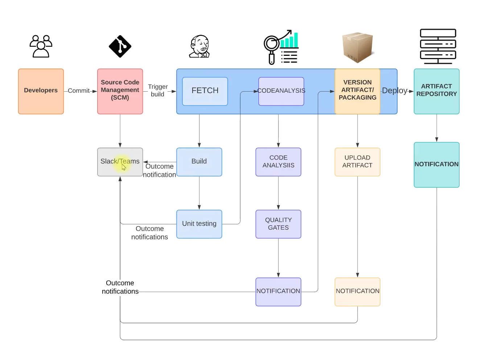

# CI-Jenkins-Tools

A collection of tools and utilities for Continuous Integration and Jenkins automation.

## Overview

This repository contains various tools, scripts, and configurations for CI/CD pipelines and Jenkins automation.


### Prerequisites

- Jenkins
- Docker (if applicable)
- Required dependencies (to be specified)

### Installation

1. Clone this repository:
```bash
git clone <repository-url>
cd CI-Jenkins-Tools
```

2. Follow the specific setup instructions for each tool/component.

## Project Structure

```
CI-Jenkins-Tools/
├── README.md
└── [Additional files and directories will be added here]
```
## Current Scenario

- Agile SDLC is followed.
- Developers make regular code changes.
- These commits need to be built and tested.
- Usually, the Build & Release Team handles this job.
- Alternatively, it may be the developers' responsibility to merge and integrate code.

## Problem: Issues with Current Situation

- In an Agile SDLC, there are frequent code changes.
- Code is not always tested frequently enough.
- This leads to the accumulation of bugs and errors in the codebase.
- Developers need to spend time reworking to fix these bugs and errors.
- The build and release process is often manual.
- There are inter-team dependencies that can slow down progress.

## Solution: Continuous Integration

- Build and test for every commit.
- Automated process for building and testing.
- Notifications for every build status.
- Fix code instantly if bugs or errors are found, rather than waiting.

## Process: Continuous Integration

Continuous Integration (CI) is a development practice where developers integrate code into a shared repository frequently, and each integration is verified by an automated build and test process. This helps to detect problems early, improve software quality, and reduce the time it takes to deliver updates.

## Benefits of CI Pipeline

- Fault isolation: Issues are detected and isolated quickly.
- Short MTTR (Mean Time To Repair): Faster recovery from failures.
- Agile: Supports agile development practices.
- No human intervention: Automated processes reduce manual effort.

## Tools Used

- **Jenkins**: Continuous Integration server
- **Git**: Version control system
- **Maven**: Build tool
- **Checkstyle**: Code analysis tool
- **Slack**: Notification system
- **Nexus**: Artifact/software repository
- **SonarQube**: Code analysis server
- **AWS EC2**: Compute resource

## Objectives and Goals

- Fault isolation
- Short MTTR (Mean Time To Repair)
- Fast turnaround on feature changes
- Less disruptive to development and deployment

## Architecture

The following diagram illustrates the CI/CD pipeline architecture used in this project:



This architecture covers the flow from code commit to build, test, code analysis, artifact packaging, repository upload, and notifications.

## Flow of Execution

The following orchestrated steps ensure a robust, automated, and scalable CI/CD pipeline deployment:

1. **Authenticate with AWS**  
   Securely log in to your AWS account to provision cloud resources.

2. **Generate Secure Access Credentials**  
   Create a login key for safe and automated access to EC2 instances.

3. **Provision Security Groups**  
   Define and configure Security Groups (SG) to control network access for:
   - Jenkins (CI Server)
   - Nexus (Artifact Repository)
   - SonarQube (Code Quality Server)

4. **Launch EC2 Instances with Automated User Data Scripts**  
   Spin up dedicated EC2 instances for:
   - Jenkins
   - SonarQube
   - Nexus
   Each instance is automatically configured using user data scripts for seamless setup.

5. **Jenkins Post-Installation Configuration**  
   Finalize Jenkins setup, install essential plugins, and prepare for pipeline orchestration.

6. **Nexus Repository Initialization**  
   Set up Nexus and create three repositories to manage build artifacts efficiently.

7. **SonarQube Post-Installation**  
   Complete SonarQube configuration for advanced code quality analysis.

8. **Jenkins Pipeline Setup**  
   - Create and configure the main Build Job
   - Integrate Slack for real-time build notifications
   - Add Checkstyle for automated code analysis
   - Integrate SonarQube for continuous code quality checks
   - Configure artifact upload jobs for seamless delivery to Nexus

9. **Pipeline Orchestration**  
   Connect all jobs into a unified Build Pipeline, ensuring smooth, end-to-end automation from code commit to artifact storage.

10. **Enable Automated Build Triggers**  
    Set up webhooks or polling to trigger builds automatically on code changes, ensuring rapid feedback and continuous integration.

11. **End-to-End Testing**  
    Validate the entire pipeline by pushing code changes from IntelliJ and monitoring the automated flow through build, test, analysis, and deployment.

12. **Automated Cleanup**  
    Implement cleanup routines to remove temporary resources and maintain a cost-effective, clutter-free environment.

This flow delivers a modern, cloud-native CI/CD solution that maximizes automation, security, and developer productivity.

---

*This README is a work in progress. More information will be added as the project develops.* 