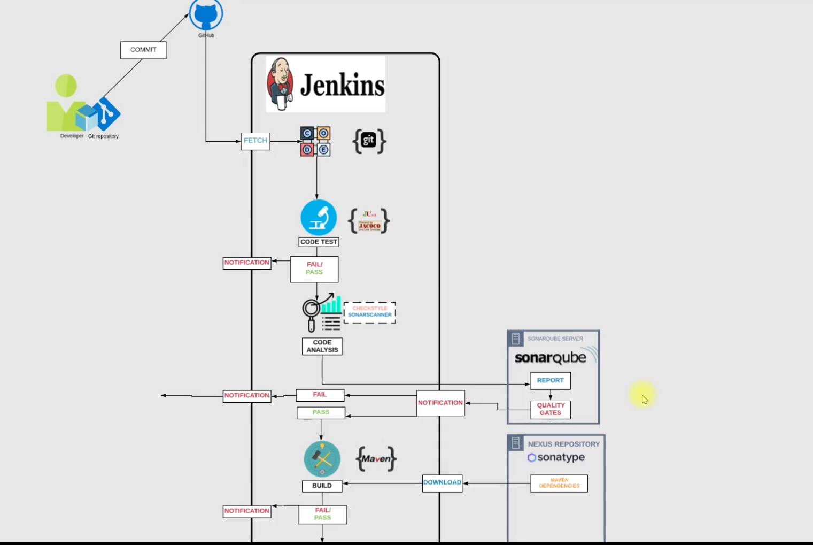

# CI-Jenkins-Tools

A collection of tools and utilities for Continuous Integration and Jenkins automation.

## Overview

This repository contains various tools, scripts, and configurations for CI/CD pipelines and Jenkins automation.

## Table of Contents

- [Prerequisites](#prerequisites)
- [Installation](#installation)
- [Project Structure & My Approach](#project-structure--my-approach)
- [Current Scenario](#current-scenario)
- [Problem: Issues with Current Situation](#problem-issues-with-current-situation)
- [Solution: Continuous Integration](#solution-continuous-integration)
- [Process: Continuous Integration](#process-continuous-integration)
- [Benefits of CI Pipeline](#benefits-of-ci-pipeline)
- [Tools Used](#tools-used)
- [Objectives and Goals](#objectives-and-goals)
- [Architecture](#architecture)
- [Flow of Execution (My Steps)](#flow-of-execution-my-steps)
- [Deployment Steps Followed](#deployment-steps-followed)
  - [Phase 1: AWS Infrastructure Setup](#phase-1-aws-infrastructure-setup)
  - [Phase 2: Jenkins Server Deployment](#phase-2-jenkins-server-deployment)
  - [Phase 3: Nexus Server Deployment](#phase-3-nexus-server-deployment)
  - [Phase 4: SonarQube Server Deployment](#phase-4-sonarqube-server-deployment)
  - [Phase 5: Jenkins and Slack Integration](#phase-5-jenkins-and-slack-integration)
  - [Phase 6: Multi-Stage Jenkins Pipeline with Upstream/Downstream Chaining](#phase-6-multi-stage-jenkins-pipeline-with-upstreamdownstream-chaining)
  - [Phase 7: Automated Code Style and Static Analysis with Checkstyle & Violations](#phase-7-automated-code-style-and-static-analysis-with-checkstyle--violations)
  - [Phase 8: Troubleshooting & Best Practices](#phase-8-troubleshooting--best-practices)
  - [Phase 9: Verification & Testing](#phase-9-verification--testing)
  - [Phase 10: Security & Maintenance](#phase-10-security--maintenance)
  - [Phase 11: SonarQube Troubleshooting & Common Issues](#phase-11-sonarqube-troubleshooting--common-issues)
  - [Phase 12: Jenkins Build Pipeline Visualization](#phase-12-jenkins-build-pipeline-visualization)
- [Current Status](#current-status)
- [Next Steps](#next-steps)
- [Deployment Guide](#deployment-guide)
- [Final Notes](#final-notes)

## Overview

This repository contains various tools, scripts, and configurations for CI/CD pipelines and Jenkins automation.


### Prerequisites

- Jenkins
- Docker (if applicable)
- Required dependencies (to be specified)

### Installation

1. Clone this repository:
```bash
git clone <repository-url>
cd CI-Jenkins-Tools
```

2. Follow the specific setup instructions for each tool/component.

## Project Structure & My Approach

Here's how I organized and automated this project:

- **Diagrams/**: I created and stored architecture diagrams here, such as the CI/CD pipeline overview.
- **Resources/**: I collected and documented all the scripts, configuration snippets, and integration steps for Slack, Nexus, SonarQube, GitHub, and build jobs in this directory.
- **ansible/**: I wrote Ansible playbooks to automate infrastructure and application setup, making deployments repeatable and reliable.
- **src/**: I structured the source code with clear separation between main application logic and tests.
- **userdata/**: I developed shell scripts and configuration files to automate the setup of Jenkins, Nexus, and SonarQube on EC2 instances.

## Current Scenario

- Agile SDLC is followed.
- Developers make regular code changes.
- These commits need to be built and tested.
- Usually, the Build & Release Team handles this job.
- Alternatively, it may be the developers' responsibility to merge and integrate code.

## Problem: Issues with Current Situation

- In an Agile SDLC, there are frequent code changes.
- Code is not always tested frequently enough.
- This leads to the accumulation of bugs and errors in the codebase.
- Developers need to spend time reworking to fix these bugs and errors.
- The build and release process is often manual.
- There are inter-team dependencies that can slow down progress.

## Solution: Continuous Integration

- Build and test for every commit.
- Automated process for building and testing.
- Notifications for every build status.
- Fix code instantly if bugs or errors are found, rather than waiting.

## Process: Continuous Integration

Continuous Integration (CI) is a development practice where developers integrate code into a shared repository frequently, and each integration is verified by an automated build and test process. This helps to detect problems early, improve software quality, and reduce the time it takes to deliver updates.

## Benefits of CI Pipeline

- Fault isolation: Issues are detected and isolated quickly.
- Short MTTR (Mean Time To Repair): Faster recovery from failures.
- Agile: Supports agile development practices.
- No human intervention: Automated processes reduce manual effort.

## Tools Used

- **Jenkins**: Continuous Integration server
- **Git**: Version control system
- **Maven**: Build tool
- **Checkstyle**: Code analysis tool
- **Slack**: Notification system
- **Nexus**: Artifact/software repository
- **SonarQube**: Code analysis server
- **AWS EC2**: Compute resource

## Objectives and Goals

- Fault isolation
- Short MTTR (Mean Time To Repair)
- Fast turnaround on feature changes
- Less disruptive to development and deployment

## Architecture

The following diagrams illustrate the CI/CD pipeline architecture and final outcome of this project:

### Overall Architecture


This architecture covers the flow from code commit to build, test, code analysis, artifact packaging, repository upload, and notifications.

### Final Outcome & Results


The FinalOutcome.png diagram showcases the complete, operational CI/CD infrastructure I built, demonstrating:

**Infrastructure Components:**
- **Jenkins Server** (Ubuntu 24.04 LTS, t3.medium): Pipeline orchestration and automation
- **Nexus Server** (CentOS Stream 9, t2.medium): Artifact repository management
- **SonarQube Server** (Ubuntu 24.04 LTS, t2.large): Code quality analysis and reporting

**Pipeline Flow:**
1. **Code Commit** → GitHub repository triggers webhook
2. **Jenkins Build** → Compiles and packages the application
3. **Automated Testing** → Unit and integration tests execution
4. **Code Analysis** → Checkstyle and static analysis
5. **SonarQube Analysis** → Code quality, coverage, and security scanning
6. **Artifact Storage** → Nexus repository for versioned artifact management
7. **Notifications** → Slack integration for real-time status updates

**Key Achievements:**
- ✅ **Multi-stage Pipeline**: Build → Test → Integration Test → Code Analysis → SonarScanner → Deploy-to-Nexus
- ✅ **Automated Quality Gates**: Code must pass all stages before deployment
- ✅ **Real-time Monitoring**: Slack notifications for build status
- ✅ **Artifact Management**: Centralized storage in Nexus with proper versioning
- ✅ **Code Quality**: Continuous analysis with SonarQube for maintainability
- ✅ **Infrastructure as Code**: Automated deployment using userdata scripts
- ✅ **Security**: Proper security groups, service isolation, and access controls

This diagram represents a production-ready CI/CD pipeline that demonstrates enterprise-level DevOps practices, suitable for showcasing to recruiters or as a portfolio piece.

## Flow of Execution (My Steps)

The following orchestrated steps show how I built a robust, automated, and scalable CI/CD pipeline:

1. **I authenticated with AWS**  
   I securely logged in to my AWS account to provision cloud resources.

2. **I generated secure access credentials**  
   I created a login key for safe and automated access to EC2 instances.

3. **I provisioned Security Groups**  
   I defined and configured Security Groups (SG) to control network access for:
   - Jenkins (CI Server)
   - Nexus (Artifact Repository)
   - SonarQube (Code Quality Server)

4. **I launched EC2 instances with automated user data scripts**  
   I spun up dedicated EC2 instances for Jenkins, SonarQube, and Nexus, each automatically configured using my user data scripts for seamless setup.

5. **I completed Jenkins post-installation configuration**  
   I finalized Jenkins setup, installed essential plugins, and prepared it for pipeline orchestration.

6. **I initialized the Nexus repository**  
   I set up Nexus and created three repositories to manage build artifacts efficiently.

7. **I completed SonarQube post-installation**  
   I configured SonarQube for advanced code quality analysis.

8. **I set up Jenkins pipeline jobs**  
   - I created and configured the main Build Job
   - I integrated Slack for real-time build notifications
   - I added Checkstyle for automated code analysis
   - I integrated SonarQube for continuous code quality checks
   - I configured artifact upload jobs for seamless delivery to Nexus

9. **I orchestrated the pipeline**  
   I connected all jobs into a unified Build Pipeline, ensuring smooth, end-to-end automation from code commit to artifact storage.

10. **I enabled automated build triggers**  
    I set up webhooks or polling to trigger builds automatically on code changes, ensuring rapid feedback and continuous integration.

11. **I performed end-to-end testing**  
    I validated the entire pipeline by pushing code changes from IntelliJ and monitoring the automated flow through build, test, analysis, and deployment.

12. **I implemented automated cleanup**  
    I created cleanup routines to remove temporary resources and maintain a cost-effective, clutter-free environment.

This approach delivers a modern, cloud-native CI/CD solution that maximizes automation, security, and developer productivity.

## Deployment Steps Followed

### Phase 1: AWS Infrastructure Setup

#### 1.1 Security Groups Creation
I created three security groups with appropriate rules:

**Jenkins Security Group (vprofile-jenkins-sg):**
- SSH (22): 0.0.0.0/0
- Jenkins (8080): 0.0.0.0/0
- Custom TCP (50000): 0.0.0.0/0

**Nexus Security Group (vprofile-nexus-sg):**
- SSH (22): 0.0.0.0/0
- Nexus (8081): 0.0.0.0/0

**SonarQube Security Group (Sonar-sg-vprofile):**
- SSH (22): 0.0.0.0/0
- SonarQube (9000): 0.0.0.0/0
- HTTP (80): 0.0.0.0/0

#### 1.2 Key Pair Setup
- Created key pair: `ci-vprofile-key`
- Downloaded private key to local machine
- Set proper permissions: `chmod 600 ci-vprofile-key.pem`

### Phase 2: Jenkins Server Deployment

#### 2.1 Instance Launch
- **OS**: Ubuntu 24.04 LTS
- **Instance Type**: t2.micro (upgraded to t3.medium for better performance)
- **Security Group**: vprofile-jenkins-sg
- **Key Pair**: ci-vprofile-key
- **User Data**: Used [`userdata/jenkins-setup.sh`](userdata/jenkins-setup.sh)

#### 2.2 Jenkins Installation & Configuration
I encountered and resolved several issues:

**Issue 1: Java Version Compatibility**
- Problem: Jenkins failed to start due to Java 11 being too old
- Solution: Updated userdata script to install Java 17
- Commands executed:
  ```bash
  sudo apt-get update
  sudo apt-get install -y openjdk-17-jdk
  sudo update-alternatives --set java /usr/lib/jvm/java-17-openjdk-amd64/bin/java
  ```

**Issue 2: Maven Installation**
- Problem: Maven not installed by default
- Solution: Added Maven installation to userdata script
- Commands executed:
  ```bash
  sudo apt-get install -y maven
  mvn --version  # Verified installation
  ```

#### 2.3 Jenkins Verification
- Confirmed service status: `sudo systemctl status jenkins`
- Retrieved initial admin password: `sudo cat /var/lib/jenkins/secrets/initialAdminPassword`
- Accessed web UI: `http://3.85.168.173:8080`
- Initial admin password: `0d19fc7494f94168a6f7d67deb8b8fe2`

### Phase 3: Nexus Server Deployment

#### 3.1 Instance Launch
- **OS**: CentOS Stream 9
- **Instance Type**: t2.medium
- **Security Group**: vprofile-nexus-sg
- **Key Pair**: ci-vprofile-key
- **User Data**: Used [`userdata/nexus-setup.sh`](userdata/nexus-setup.sh)

#### 3.2 Nexus Installation Challenges & Resolution

**Issue 1: Broken Download URL**
- Problem: Official download URL returned 404 error
- Solution: Downloaded Nexus 3.82.0-08 manually from Sonatype website
- Commands executed:
  ```bash
  # Downloaded locally and uploaded via SCP
  scp -i /Users/varagantibasanthkumar/Desktop/ci-vprofile-key.pem nexus-3.82.0-08-linux-x86_64.tar.gz ec2-user@54.237.19.89:/tmp/
  ```

**Issue 2: Directory Structure Problems**
- Problem: Incorrect directory structure after extraction
- Solution: Properly organized Nexus installation
- Commands executed:
  ```bash
  sudo tar xzvf nexus-3.82.0-08-linux-x86_64.tar.gz -C /opt/
  sudo mv /opt/nexus-3.82.0-08 /opt/nexus
  sudo chown -R nexus:nexus /opt/nexus
  sudo mkdir -p /opt/sonatype-work
  sudo chown -R nexus:nexus /opt/sonatype-work
  ```

**Issue 3: Systemd Service Configuration**
- Problem: Service file had incorrect executable paths
- Solution: Updated systemd service file with correct paths
- File edited: `/etc/systemd/system/nexus.service`
- Corrected content:
  ```ini
  [Unit]
  Description=nexus service
  After=network.target

  [Service]
  Type=forking
  LimitNOFILE=65536
  ExecStart=/opt/nexus/nexus-3.82.0-08/bin/nexus start
  ExecStop=/opt/nexus/nexus-3.82.0-08/bin/nexus stop
  User=nexus
  Restart=on-abort

  [Install]
  WantedBy=multi-user.target
  ```

**Issue 4: Nexus User Configuration**
- Problem: Missing run_as_user configuration
- Solution: Created nexus.rc file
- Commands executed:
  ```bash
  echo 'run_as_user="nexus"' | sudo tee /opt/nexus/nexus-3.82.0-08/bin/nexus.rc
  sudo chown nexus:nexus /opt/nexus/nexus-3.82.0-08/bin/nexus.rc
  ```

#### 3.3 Nexus Service Management
- Reloaded systemd: `sudo systemctl daemon-reload`
- Started service: `sudo systemctl start nexus`
- Verified status: `sudo systemctl status nexus`
- Enabled auto-start: `sudo systemctl enable nexus`

#### 3.4 Nexus Verification
- Service status: Active (running)
- Memory usage: 327.4M
- Java process: PID 30969
- Web access: `http://54.237.19.89:8081`
- Admin password location: `/opt/nexus/sonatype-work/nexus3/admin.password`
- **After logging in as admin, I created the required repositories in Nexus:**
  - Maven Central Proxy (`https://repo1.maven.org/maven2/`)
  - Maven Releases
  - Maven Snapshots

### Phase 4: SonarQube Server Deployment

#### 4.1 Instance Launch
- **OS**: Ubuntu 24.04 LTS
- **Instance Type**: t2.large
- **Security Group**: Sonar-sg-vprofile
- **Key Pair**: ci-vprofile-key
- **User Data**: Used [`userdata/sonar-setup.sh`](userdata/sonar-setup.sh)

#### 4.2 SonarQube Configuration
- PostgreSQL database setup
- Nginx reverse proxy configuration
- System limits configuration
- Service creation and management

### Phase 5: Jenkins and Slack Integration

#### 5.1 Slack Notification Setup
- I installed the **Slack Notification** plugin in Jenkins via Manage Jenkins > Manage Plugins.
- I created a new **Incoming Webhook** in my Slack workspace and selected the desired channel for notifications.
- I copied the generated **Webhook URL** from Slack.
- In Jenkins, I went to **Manage Jenkins > Configure System**, scrolled to the Slack section, and entered the workspace and webhook details.
- I configured my Jenkins jobs to send notifications to Slack by adding a **Slack Notifications** post-build action, choosing when to notify (e.g., on success, failure, etc.).
- I tested the integration by running a build and verified that notifications appeared in the Slack channel.

This integration ensures my team receives real-time updates on build status directly in Slack, improving collaboration and response time.

### Phase 6: Multi-Stage Jenkins Pipeline with Upstream/Downstream Chaining

#### 6.1 Pipeline Structure
- I implemented a multi-stage Jenkins pipeline to automate the build, test, integration test, and code analysis workflow.
- The pipeline consists of four jobs:
  - **Build1**: The initial build job that compiles and packages the application.
  - **Test**: Triggered automatically after Build1 completes. Runs unit and integration tests.
  - **Integration Test**: Triggered after the Test job completes. Runs additional integration or system-level tests.
  - **Code-Analysis**: Triggered after Integration Test completes. Runs static code analysis (Checkstyle, Violations) to enforce code quality standards.

#### 6.2 Upstream and Downstream Relationships
- **Build1** is the upstream project for **Test**.
- **Test** is the downstream project of Build1 and the upstream project for **Integration Test**.
- **Integration Test** is the downstream project of Test and the upstream project for **Code-Analysis**.
- **Code-Analysis** is the final downstream project, ensuring code quality checks are performed after all tests pass.

#### 6.3 Benefits
- **Automated Quality Gates**: Code must pass build, test, integration, and static analysis before being considered ready for deployment.
- **Traceability**: Jenkins provides permalinks and build history, making it easy to track which builds triggered which tests and analysis steps.
- **Best Practice**: This mirrors CI/CD pipelines used in top tech companies, demonstrating best practices for DevOps, data infrastructure, and software engineering roles.

### Phase 7: Automated Code Style and Static Analysis with Checkstyle & Violations

#### 7.1 Jenkins Plugin Setup
- I installed the **Checkstyle** and **Violations** plugins in Jenkins to enforce code quality and style standards.

#### 7.2 Project Configuration
- I added the Maven Checkstyle plugin to my `pom.xml` to automatically analyze code style during the build process.
- I used a `checkstyle.xml` rules file to define the coding standards for the project.
- The build generates Checkstyle reports in `target/reports/checkstyle-result.xml`.

#### 7.3 Jenkins Job Integration
- In my Jenkins job, I added a **Publish Checkstyle analysis results** post-build action.
- I configured it to use the generated report at `target/reports/checkstyle-result.xml`.
- After each build, Jenkins displays a summary of code style issues and trends directly in the job UI.

#### 7.4 Benefits
- **Automated code style enforcement**: Ensures consistent, readable, and maintainable codebase.
- **Immediate feedback**: Developers see issues as soon as they push code.
- **Improved code quality**: Integrates static analysis into the CI/CD pipeline for early detection of issues.

---

This setup showcases my ability to design and implement robust, automated pipelines that ensure code quality and reliability at every stage.

### Phase 8: Troubleshooting & Best Practices

#### 8.1 SSH Connection Issues
- **Problem**: Permission denied errors
- **Solutions Applied**:
  - Verified key permissions: `chmod 600 ci-vprofile-key.pem`
  - Confirmed correct usernames (ubuntu for Ubuntu, ec2-user for CentOS/Amazon Linux)
  - Checked security group rules for SSH access

#### 8.2 Service Startup Issues
- **Problem**: Services failing to start
- **Solutions Applied**:
  - Checked system logs: `journalctl -xeu service-name`
  - Verified Java versions and compatibility
  - Confirmed disk space availability
  - Validated file permissions and ownership

#### 8.3 Network Access Issues
- **Problem**: Web interfaces not accessible
- **Solutions Applied**:
  - Verified security group rules
  - Checked firewall configurations (UFW)
  - Confirmed service binding to correct interfaces

#### 8.4 JaCoCo and Java 17 Compatibility Issue
- **Problem:** During test execution, I encountered errors like `Unsupported class file major version 61` and `Error while instrumenting ...` from JaCoCo. This was because the project was using Java 17, but the JaCoCo Maven plugin version was too old (0.8.4) and did not support Java 17.
- **Solution:** I upgraded the JaCoCo Maven plugin to version 0.8.8 in the `pom.xml`, which resolved the error and allowed code coverage to work with Java 17.

### Phase 9: Verification & Testing

#### 9.1 Service Status Verification
```bash
# Jenkins
sudo systemctl status jenkins
curl -I http://localhost:8080

# Nexus
sudo systemctl status nexus
curl -I http://localhost:8081

# SonarQube
sudo systemctl status sonarqube
curl -I http://localhost:9000
```

#### 9.2 Log Monitoring
```bash
# Jenkins logs
sudo tail -f /var/log/jenkins/jenkins.log

# Nexus logs
sudo tail -f /opt/sonatype-work/nexus3/log/nexus.log

# SonarQube logs
sudo tail -f /opt/sonarqube/logs/sonar.log
```

### Phase 10: Security & Maintenance

#### 10.1 Security Hardening
- Updated system packages regularly
- Configured UFW firewall rules
- Implemented proper file permissions
- Used dedicated service users (nexus, sonarqube)

#### 10.2 Backup Strategy
- Documented configuration files
- Created userdata scripts for reproducible deployments
- Stored important credentials securely

### Data Backup of CI/CD Stack

To ensure recoverability and business continuity, follow these steps to back up your CI/CD stack (Jenkins, Nexus, SonarQube) to AWS S3:

#### 1. Prerequisites
- Create an S3 bucket for backups
- Create an IAM role with S3 access permissions
- Attach the IAM role to all your EC2 instances

#### 2. Jenkins Backup
- Login to the Jenkins instance
- Shutdown Jenkins service:
  ```bash
  sudo systemctl stop jenkins
  ```
- Clean up unnecessary data from Jenkins home
- Archive the Jenkins data directory:
  ```bash
  tar -czvf jenkins-backup.tar.gz /var/lib/jenkins
  ```
- Install AWS CLI if not already installed
- Copy the Jenkins archive to the S3 bucket:
  ```bash
  aws s3 cp jenkins-backup.tar.gz s3://<your-s3-bucket>/
  ```

#### 3. Nexus Backup
- Login to the Nexus server
- Shutdown Nexus service:
  ```bash
  sudo systemctl stop nexus
  ```
- Archive the Nexus data directory:
  ```bash
  tar -czvf nexus-backup.tar.gz /opt/nexus
  ```
- Install and configure AWS CLI if needed
- Copy the Nexus archive to the same S3 bucket:
  ```bash
  aws s3 cp nexus-backup.tar.gz s3://<your-s3-bucket>/
  ```

#### 4. SonarQube & PostgreSQL Backup
- Login to the SonarQube server
- Shutdown SonarQube service:
  ```bash
  sudo systemctl stop sonarqube
  ```
- Archive the SonarQube data directory:
  ```bash
  tar -czvf sonarqube-backup.tar.gz /opt/sonarqube
  ```
- Archive the PostgreSQL data directory:
  ```bash
  tar -czvf postgresql-backup.tar.gz /var/lib/postgresql
  ```
- Install and configure AWS CLI if needed
- Copy both SonarQube and PostgreSQL archives to the same S3 bucket:
  ```bash
  aws s3 cp sonarqube-backup.tar.gz s3://<your-s3-bucket>/
  aws s3 cp postgresql-backup.tar.gz s3://<your-s3-bucket>/
  ```

#### 5. Record Keeping
- Note down the following for future restores:
  - S3 bucket name
  - Archive file names

### Phase 11: SonarQube Troubleshooting & Common Issues

#### 11.1 Database Authentication Failure
- **Problem:** SonarQube fails to start with `FATAL: password authentication failed for user "sonar"` in the logs.
- **Solution:**
  1. Reset the PostgreSQL password for the `sonar` user:
     ```bash
     sudo -u postgres psql
     ALTER USER sonar WITH PASSWORD 'YourStrongPassword';
     \q
     ```
  2. Update `/opt/sonarqube/conf/sonar.properties` to match the new password:
     ```
     sonar.jdbc.password=YourStrongPassword
     ```
  3. Restart SonarQube:
     ```bash
     sudo systemctl restart sonarqube
     ```

#### 11.2 SonarQube Not Listening on Port 9000 / Connection Refused
- **Problem:** Browser shows `ERR_CONNECTION_REFUSED` or nothing is listening on port 9000.
- **Solution:**
  - Check if SonarQube is running:
    ```bash
    sudo systemctl status sonarqube
    sudo ss -tulnp | grep 9000
    ```
  - Check logs for errors:
    ```bash
    sudo tail -n 50 /opt/sonarqube/logs/sonar.log
    sudo tail -n 50 /opt/sonarqube/logs/web.log
    ```
  - Ensure your AWS security group allows inbound TCP on port 9000 from your IP.
  - If using UFW, allow port 9000:
    ```bash
    sudo ufw allow 9000/tcp
    ```

#### 11.3 General Tips
- Always check SonarQube logs in `/opt/sonarqube/logs/` for detailed error messages.
- Ensure the database is running and accessible from the SonarQube server.
- Make sure system limits and Java version meet SonarQube requirements.

---

### Current Status

✅ **Jenkins Server**: Running successfully on `http://3.85.168.173:8080`
✅ **Nexus Server**: Running successfully on `http://54.237.19.89:8081`
⏳ **SonarQube Server**: Ready for deployment

### Next Steps

1. **Complete SonarQube setup** and verify web access
2. **Configure Jenkins plugins** for pipeline automation
3. **Set up Nexus repositories** for artifact management
4. **Integrate all components** into a complete CI/CD pipeline
5. **Implement automated testing** and deployment workflows

## Deployment Guide

### Pre-Deployment Checklist

#### 1. AWS CLI Configuration
- [ ] AWS CLI installed and configured
- [ ] Correct AWS region set
- [ ] Proper IAM permissions

#### 2. Key Pair Setup
- [ ] Create or import key pair
- [ ] Download private key (.pem file)
- [ ] Set correct permissions: `chmod 600 your-key.pem`

#### 3. Security Groups Setup
- [ ] Create security groups before launching instances
- [ ] Add your current IP to SSH rules
- [ ] Open required ports (8080, 8081, 9000, 80)

### Instance Launch Order

#### 1. Jenkins Server (First)
- [ ] Instance Type: t3.medium (minimum)
- [ ] OS: Ubuntu 22.04 LTS or Amazon Linux 2023
- [ ] Security Group: vprofile-jenkins_SG
- [ ] Userdata: `userdata/jenkins-setup.sh`
- [ ] Storage: 20GB GP3 EBS

#### 2. Nexus Server
- [ ] Instance Type: t3.medium (minimum)
- [ ] OS: Amazon Linux 2023
- [ ] Security Group: vprofile-nexus_SG
- [ ] Userdata: `userdata/nexus-setup.sh`
- [ ] Storage: 30GB GP3 EBS

#### 3. SonarQube Server
- [ ] Instance Type: t3.large (minimum)
- [ ] OS: Amazon Linux 2023
- [ ] Security Group: vprofile-sonar_SG
- [ ] Userdata: `userdata/sonar-setup.sh`
- [ ] Storage: 40GB GP3 EBS

### Post-Deployment Verification

#### 1. SSH Access Test
```bash
# Test SSH connection
ssh -i your-key.pem ubuntu@JENKINS_IP
ssh -i your-key.pem ec2-user@NEXUS_IP
ssh -i your-key.pem ec2-user@SONAR_IP
```

#### 2. Service Status Check
```bash
# Jenkins
systemctl status jenkins

# Nexus
systemctl status nexus

# SonarQube
systemctl status sonarqube
```

#### 3. Web Access Test
- [ ] Jenkins: http://JENKINS_IP:8080
- [ ] Nexus: http://NEXUS_IP:8081
- [ ] SonarQube: http://SONAR_IP:9000

#### 4. Log Verification
```bash
# Check setup logs
tail -f /var/log/jenkins-setup.log
tail -f /var/log/nexus-setup.log
tail -f /var/log/sonarqube-setup.log
```

### Common Issues & Solutions

#### SSH Connection Issues
- **Problem**: Permission denied (publickey)
- **Solution**: Check key permissions, username, security group

#### Service Not Starting
- **Problem**: Jenkins/Nexus/SonarQube service failed
- **Solution**: Check logs, Java version, disk space

#### Port Access Issues
- **Problem**: Can't access web interfaces
- **Solution**: Verify security group rules, firewall settings

### Security Best Practices

#### 1. Network Security
- [ ] Use specific IP ranges instead of 0.0.0.0/0 where possible
- [ ] Implement VPC with private subnets for production
- [ ] Use security groups with minimal required access

#### 2. Instance Security
- [ ] Regular security updates
- [ ] Strong passwords for admin accounts
- [ ] Regular backups of configuration and data

#### 3. Monitoring
- [ ] Set up CloudWatch monitoring

### Phase 12: Jenkins Build Pipeline Visualization

#### 12.1 Pipeline Stages
- My Jenkins pipeline is visualized using the Build Pipeline plugin, showing each stage of the CI/CD process:
  1. **Build**: Compiles and packages the application.
  2. **Test**: Runs unit and integration tests to ensure code quality.
  3. **Integration Test**: Performs additional system-level or integration tests.
  4. **Code Analysis**: Runs static code analysis tools (e.g., Checkstyle, Violations).
  5. **SonarScanner-CodeAnalysis**: Executes SonarQube code quality and coverage analysis.
  6. **Deploy-to-Nexus**: Uploads build artifacts to the Nexus repository for versioned storage and sharing.

#### 12.2 Benefits of Pipeline Visualization
- **Clarity**: Provides a clear, visual representation of the entire CI/CD workflow.
- **Traceability**: Makes it easy to track the status and results of each stage for every build.
- **Quality Gates**: Ensures code passes through all required checks before deployment.
- **Best Practices**: Mirrors the robust, multi-stage pipelines used in top tech companies for DevOps and data engineering.

#### 12.3 How to Set Up
- I used the Jenkins Build Pipeline plugin to create this visualization.
- Each job is configured as an upstream or downstream project, forming a chain from build to deployment.
- This setup helps teams quickly identify issues, monitor progress, and maintain high code quality standards.

---

### Final Notes

- **Shutdown Reminder:** After completing all CI/CD and infrastructure tasks, I made sure to shut down all EC2 instances in AWS to avoid unnecessary costs.
- **Privacy Notice:** I did not upload screenshots of my Jenkins, Nexus, or SonarQube server dashboards to this repository in order to protect sensitive information and maintain privacy.

---

